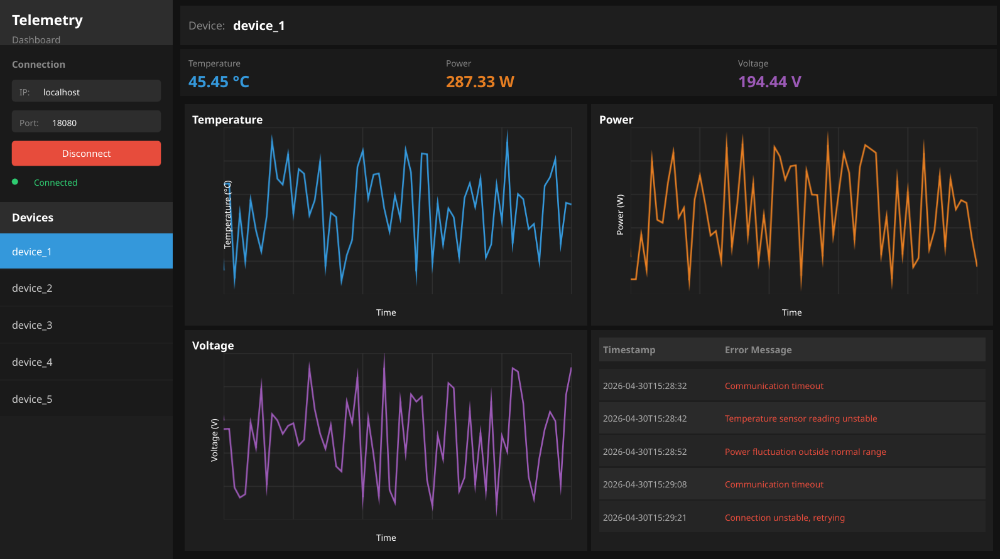

# 📊 Telemetry Dashboard

<div align="center">


*A modern real-time telemetry monitoring system with C++ backend and Qt/QML frontend*

[Features](#-features) • [Installation](#-installation) • [Usage](#-usage) • [Project Structure](#-project-structure) • [Contributing](#-contributing)

</div>

---

## 📖 Overview

Telemetry Dashboard is a comprehensive real-time monitoring system designed for IoT device telemetry collection, visualization, and error tracking. The system features a high-performance C++ backend with REST API and WebSocket support, paired with a modern Qt/QML dashboard for intuitive data visualization.

### 🖼️ Dashboard Preview



---

## ✨ Features

### Backend
- 🚀 **High-Performance C++ Server** - Built with Crow web framework for efficient request handling
- 🌐 **REST API** - Full CRUD operations for telemetry data and error management
- 🔌 **WebSocket Support** - Real-time data streaming to connected clients
- 💾 **In-Memory Storage** - Fast data access with configurable retention policies
- 📈 **Telemetry Service** - Centralized data management with device isolation
- ⚠️ **Error Tracking** - Dedicated error logging and retrieval system
- 🔧 **Configurable Limits** - Adjustable storage limits for telemetry and error points

### Frontend
- 🎨 **Modern Qt/QML Interface** - Clean, responsive dashboard design
- 📊 **Real-Time Charts** - Live telemetry data visualization using Canvas
- 📱 **Device Management** - View and monitor multiple devices simultaneously
- 🔴 **Error Monitoring** - Dedicated error view with filtering capabilities
- 🔌 **WebSocket Client** - Automatic connection management with reconnection logic
- 🎯 **MVVM Architecture** - Clean separation of concerns with ViewModels

### Tools
- 🤖 **Device Simulator** - Python-based simulator for testing with multiple devices
- 🧪 **Load Testing** - Simulate 1-100+ devices for performance testing

---

## 🛠️ Technology Stack

### Backend
| Technology | Version | Purpose |
|------------|---------|---------|
| **C++** | 17 | Core language |
| **Crow** | Latest | Web framework |
| **CMake** | 3.16+ | Build system |
| **pthread** | - | Threading support |

### Frontend
| Technology | Version | Purpose |
|------------|---------|---------|
| **Qt** | 6.0+ | UI Framework |
| **QML** | - | Declarative UI |
| **Qt WebSockets** | - | Real-time communication |
| **CMake** | 3.16+ | Build system |

### Development Tools
| Technology | Purpose |
|------------|---------|
| **Python 3** | Device simulator |
| **requests** | HTTP client for simulator |

---

## 📦 Installation

### Prerequisites

#### Linux (Ubuntu/Debian)
```bash
# Install CMake
sudo apt-get install cmake build-essential

# Install Crow web framework
git clone https://github.com/CrowCpp/Crow.git
cd Crow
mkdir build && cd build
cmake ..
make
sudo make install

# Install Qt6
sudo apt-get install qt6-base-dev qt6-declarative-dev qt6-websockets-dev
```

#### macOS
```bash
# Install using Homebrew
brew install cmake qt@6

# Install Crow
git clone https://github.com/CrowCpp/Crow.git
cd Crow
mkdir build && cd build
cmake ..
make
sudo make install
```

#### Windows
```bash
# Install vcpkg
git clone https://github.com/Microsoft/vcpkg.git
cd vcpkg
.\bootstrap-vcpkg.bat

# Install dependencies
.\vcpkg install crow:x64-windows qt6:x64-windows
```

### Building the Project

```bash
# Clone the repository
git clone <repository-url>
cd same

# Create build directory
mkdir build
cd build

# Configure with CMake
cmake ..

# Build all components
cmake --build .

# Or build specific components
cmake --build . --target telemetry-server    # Backend only
cmake --build . --target telemetry-dashboard  # Frontend only
```

### Build Options

```bash
# Disable frontend build
cmake -DBUILD_FRONTEND=OFF ..

# Disable backend build
cmake -DBUILD_BACKEND=OFF ..
```

---

## 🚀 Usage

### Starting the Backend Server

```bash
# Navigate to build directory
cd build

# Run the telemetry server
./backend/telemetry-server

# The server will start on http://0.0.0.0:18080
```

**Default Configuration:**
- Port: `18080`
- Bind Address: `0.0.0.0`
- Max Telemetry Points: `1000` per device
- Max Error Points: `100` per device

### Starting the Frontend Dashboard

```bash
# Navigate to build directory
cd build

# Run the dashboard
./frontend/telemetry-dashboard

# The dashboard will connect to ws://localhost:18080/ws
```

### Using the Device Simulator

```bash
# Install Python dependencies
cd tools
pip install -r requirements.txt

# Simulate 5 devices with default settings
python device_simulator.py --devices 5

# Simulate 20 devices with custom URL
python device_simulator.py --devices 20 --url http://localhost:18080/api/telemetry

# Simulate 10 devices with 2-second update interval
python device_simulator.py --devices 10 --interval 2

# Simulate 50 devices with verbose output
python device_simulator.py --devices 50 --verbose
```

### REST API Examples

#### Submit Telemetry Data
```bash
curl -X POST http://localhost:18080/api/telemetry \
  -H "Content-Type: application/json" \
  -d '{
    "device_id": "device-001",
    "timestamp": 1714521600000,
    "data": {
      "temperature": 25.5,
      "power": 150.0,
      "voltage": 12.3
    }
  }'
```

#### Get Telemetry Data
```bash
# Get all telemetry for a device
curl http://localhost:18080/api/telemetry/device-001

# Get latest telemetry point
curl http://localhost:18080/api/telemetry/device-001/latest

# Get telemetry with limit
curl http://localhost:18080/api/telemetry/device-001?limit=10
```

#### Submit Error Message
```bash
curl -X POST http://localhost:18080/api/errors \
  -H "Content-Type: application/json" \
  -d '{
    "device_id": "device-001",
    "timestamp": 1714521600000,
    "error_code": "E001",
    "message": "Temperature sensor malfunction",
    "severity": "high"
  }'
```

#### Get Error Messages
```bash
# Get all errors for a device
curl http://localhost:18080/api/errors/device-001

# Get errors by severity
curl http://localhost:18080/api/errors/device-001?severity=high
```

### WebSocket Connection

The dashboard automatically connects to the WebSocket endpoint at `ws://localhost:18080/ws`. For custom clients:

```javascript
// JavaScript WebSocket client example
const ws = new WebSocket('ws://localhost:18080/ws');

ws.onopen = () => {
  console.log('Connected to telemetry server');
};

ws.onmessage = (event) => {
  const data = JSON.parse(event.data);
  console.log('Received:', data);
};

ws.onerror = (error) => {
  console.error('WebSocket error:', error);
};
```

---

## 📁 Project Structure

```
same/
├── backend/                    # C++ Backend
│   ├── include/telemetry/
│   │   ├── api/               # REST and WebSocket API
│   │   │   ├── RestApi.h
│   │   │   └── WebSocketApi.h
│   │   ├── models/            # Data models
│   │   │   ├── TelemetryData.h
│   │   │   └── ErrorMessage.h
│   │   ├── services/          # Business logic
│   │   │   ├── TelemetryService.h
│   │   │   ├── ErrorService.h
│   │   │   └── WebSocketService.h
│   │   ├── storage/           # Data storage
│   │   │   ├── IDataStorage.h
│   │   │   └── InMemoryStorage.h
│   │   └── TelemetryServer.h  # Main server class
│   ├── src/                   # Implementation files
│   │   ├── api/
│   │   ├── models/
│   │   ├── services/
│   │   ├── storage/
│   │   └── main.cpp
│   └── CMakeLists.txt
│
├── frontend/                   # Qt/QML Frontend
│   ├── include/frontend/
│   │   ├── models/            # Data models
│   │   │   ├── TelemetryPoint.h
│   │   │   ├── ErrorEntry.h
│   │   │   └── DeviceData.h
│   │   ├── viewmodels/        # MVVM ViewModels
│   │   │   └── TelemetryViewModel.h
│   │   └── websocket/         # WebSocket client
│   │       └── WebSocketClient.h
│   ├── qml/                   # QML UI files
│   │   ├── Main.qml
│   │   ├── DeviceView.qml
│   │   ├── ErrorView.qml
│   │   └── TelemetryChartView.qml
│   ├── src/                   # Implementation files
│   │   ├── models/
│   │   ├── viewmodels/
│   │   ├── websocket/
│   │   └── main.cpp
│   └── CMakeLists.txt
│
├── tools/                      # Development tools
│   ├── device_simulator.py    # IoT device simulator
│   └── requirements.txt
│
├── doc/                        # Documentation
│   └── ui.png                  # Dashboard screenshot
│
├── CMakeLists.txt             # Root CMake configuration
└── README.md                  # This file
```

---

## 🤝 Contributing

Contributions are welcome! Please follow these guidelines:

### Development Workflow

1. **Fork the repository**
   ```bash
   git clone https://github.com/your-username/same.git
   cd same
   ```

2. **Create a feature branch**
   ```bash
   git checkout -b feature/your-feature-name
   ```

3. **Make your changes**
   - Follow the existing code style
   - Add tests for new functionality
   - Update documentation as needed

4. **Build and test**
   ```bash
   mkdir build && cd build
   cmake ..
   cmake --build .
   ctest  # Run tests if available
   ```

5. **Commit your changes**
   ```bash
   git add .
   git commit -m "feat: add your feature description"
   ```

6. **Push and create a pull request**
   ```bash
   git push origin feature/your-feature-name
   ```

### Code Style

- **C++**: Follow Google C++ Style Guide
- **QML**: Follow Qt QML Coding Conventions
- **Python**: Follow PEP 8
- Use meaningful variable and function names
- Add comments for complex logic
- Keep functions focused and concise

### Commit Messages

Use conventional commit format:
- `feat:` - New features
- `fix:` - Bug fixes
- `docs:` - Documentation changes
- `style:` - Code style changes (formatting)
- `refactor:` - Code refactoring
- `test:` - Test additions or changes
- `chore:` - Build process or auxiliary tool changes
